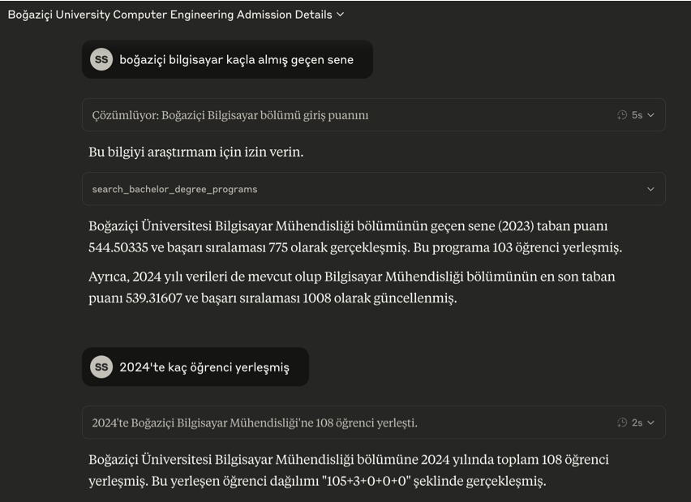

# YOKATLAS API MCP Sunucusu

Bu proje, [YÖKATLAS](https://yokatlas.yok.gov.tr/) verilerine erişimi sağlayan `yokatlas-py` Python kütüphanesini kullanarak bir [FastMCP](https://www.gofastmcp.com/) sunucusu oluşturur. Bu sayede, YÖKATLAS API fonksiyonları, Model Context Protocol (MCP) destekleyen LLM (Büyük Dil Modeli) uygulamaları ve diğer istemciler tarafından araç (tool) olarak kullanılabilir hale gelir.



## 🎯 Temel Özellikler

* YÖKATLAS verilerine programatik erişim için standart bir MCP arayüzü.
* Lisans ve Önlisans program detaylarını getirme.
* Lisans ve Önlisans programları için kapsamlı arama yapabilme (Tercih Sihirbazı).
* Claude Desktop uygulaması ile kolay entegrasyon.
* Programa ait detayları veya arama sonuçlarını PDF rapor olarak oluşturabilme ve yerel sisteme indirebilme.

## 📋 Ön Gereksinimler

* **Python Sürümü:** Python 3.8 veya daha yeni bir sürümünün sisteminizde kurulu olması gerekmektedir. Python'ı [python.org](https://www.python.org/downloads/) adresinden indirebilirsiniz.
* **pip:** Python ile birlikte gelen `pip` paket yöneticisinin çalışır durumda olması gerekir.

## ⚙️ Kurulum Adımları (Claude Desktop için)

Claude Desktop uygulamasına yükleme yapabilmek için öncelikle `uv` ve `fastmcp` komut satırı araçlarını kurmanız, ardından proje dosyalarını almanız gerekmektedir.

### 1. `uv` Kurulumu
`uv`, Rust ile yazılmış son derece hızlı bir Python paket kurucusu, çözümleyicisi ve sanal ortam yöneticisidir. `fastmcp` kurulumu ve Claude Desktop entegrasyonu için `uv` kullanılması önerilmektedir.

* **macOS ve Linux için:**
    Terminali açın ve aşağıdaki komutu çalıştırın:
    ```bash
    curl -LsSf https://astral.sh/uv/install.sh | sh
    ```
* **Windows için (PowerShell kullanarak):**
    PowerShell'i açın ve aşağıdaki komutu çalıştırın:
    ```bash
    powershell -c "irm https://astral.sh/uv/install.ps1 | iex"
    ```
* **Alternatif olarak `pip` ile (tüm platformlar):**
    Eğer yukarıdaki yöntemler işe yaramazsa veya `pip` kullanmayı tercih ederseniz:
    ```bash
    pip install uv
    ```
Kurulumdan sonra, `uv` komutunun sisteminiz tarafından tanınması için terminalinizi yeniden başlatmanız veya `PATH` ortam değişkeninizi güncellemeniz (örneğin, Linux/macOS için `source $HOME/.cargo/env` veya `source $HOME/.bashrc`, `source $HOME/.zshrc` gibi) gerekebilir. `uv --version` komutu ile kurulumu doğrulayabilirsiniz.

### 2. `fastmcp` Komut Satırı Aracının (CLI) Kurulumu
`fastmcp` CLI, MCP sunucularını yönetmek ve özellikle `fastmcp install` komutu ile Claude Desktop'a kurmak için gereklidir. `uv` kullanarak kurulması önerilir:

```bash
uv pip install fastmcp
```
Eğer `uv` kurulumunda sorun yaşadıysanız veya `pip` kullanmak isterseniz, `fastmcp`'yi `pip` ile de kurabilirsiniz:
```bash
pip install fastmcp
```
`fastmcp --version` komutu ile kurulumu doğrulayabilirsiniz.

### 3. Proje Dosyalarını Alın
Bu YOKATLAS MCP sunucusunun kaynak kodlarını bilgisayarınıza indirin.
```bash
git clone https://github.com/saidsurucu/yokatlas-mcp.git
cd yokatlas-mcp
```
Bu README.md dosyasının ve `yokatlas_mcp_server.py` script'inin bulunduğu dizine `cd` komutu ile geçmiş olacaksınız.

### 4. Sunucuya Özel Bağımlılıkların Bilinmesi
Bu sunucunun (`yokatlas_mcp_server.py`) çalışması için bazı Python kütüphanelerine ihtiyacı vardır. Bu kütüphaneler Claude Desktop entegrasyonu sırasında (`fastmcp install` veya manuel kurulumda) belirtilecektir:
* `yokatlas-py`
* `beautifulsoup4`
* `setuptools`
* `reportlab` (PDF rapor oluşturma için)
* `fastmcp` (sunucunun kendisi için de gereklidir)

(Eğer sunucuyu bağımsız olarak geliştirmek veya test etmek isterseniz, bir sanal ortam (`python -m venv .venv` & `.venv/bin/activate` veya `.venv\Scripts\activate`) oluşturup bu bağımlılıkları `uv pip install fastmcp yokatlas-py beautifulsoup4 setuptools reportlab` komutuyla kurabilirsiniz.)

## 🚀 Claude Desktop Entegrasyonu (`fastmcp install` ile - Önerilen)

Yukarıdaki kurulum adımlarını tamamladıktan sonra, bu sunucuyu Claude Desktop uygulamasına kalıcı bir araç olarak eklemenin en kolay yolu `fastmcp install` komutunu kullanmaktır:

1.  Terminalde `yokatlas_mcp_server.py` dosyasının bulunduğu `yokatlas-mcp` dizininde olduğunuzdan emin olun.
2.  Aşağıdaki komutu çalıştırın:
    ```bash
    fastmcp install yokatlas_mcp_server.py --name "YOKATLAS API Servisi" --with yokatlas-py --with beautifulsoup4 --with setuptools --with reportlab
    ```
    * `--name "YOKATLAS API Servisi"`: Araç Claude Desktop'ta bu isimle görünecektir.
    * `--with yokatlas-py --with beautifulsoup4 --with setuptools --with reportlab`: Sunucunun çalışması için gereken Python bağımlılıklarını belirtir. `fastmcp` kendisi de bu ortama dahil edilecektir (`fastmcp install` bunu otomatik olarak yönetir).

Bu komut, `uv` kullanarak sunucunuz için izole bir Python ortamı oluşturacak, belirtilen bağımlılıkları kuracak ve aracı Claude Desktop uygulamasına kaydedecektir. Kurulum tamamlandıktan sonra "YOKATLAS API Servisi" Claude Desktop uygulamanızda kullanılabilir olacaktır.

## ⚙️ Claude Desktop Manuel Kurulumu (Yapılandırma Dosyası ile - Alternatif)

`fastmcp install` komutunu kullanmak yerine, sunucunuzu Claude Desktop uygulamasına manuel olarak da ekleyebilirsiniz. Bu yöntem, yapılandırma dosyasını doğrudan düzenlemeyi içerir ve daha fazla kontrol sağlar.

**Uyarı:** Yapılandırma dosyasını düzenlerken dikkatli olun. Hatalı bir yapılandırma Claude Desktop uygulamasının düzgün çalışmamasına neden olabilir.

1.  **Claude Desktop Ayarlarını Açın:**
    Claude Desktop uygulamasında, menü çubuğundan (macOS'te üst menü, Windows'ta genellikle uygulama içi menü) "Settings..." (Ayarlar...) seçeneğine gidin.

2.  **Geliştirici Ayarlarına Girin ve Yapılandırma Dosyasını Düzenleyin:**
    Açılan ayarlar penceresinde sol taraftaki menüden "Developer" (Geliştirici) sekmesine tıklayın. Ardından "Edit Config" (Yapılandırmayı Düzenle) düğmesine tıklayın.

    Bu işlem, aşağıdaki konumlarda bulunan `claude_desktop_config.json` dosyasını oluşturacak (eğer yoksa) ve dosya gezgininde gösterecektir:
    * **macOS:** `~/Library/Application Support/Claude/claude_desktop_config.json`
    * **Windows:** `%APPDATA%\Claude\claude_desktop_config.json`

3.  **Yapılandırma Dosyasını Düzenleyin:**
    `claude_desktop_config.json` dosyasını bir metin düzenleyici ile açın. Dosyanın içeriği aşağıdaki gibi bir yapıda olacaktır. `mcpServers` objesine (eğer `mcpServers` objesi yoksa, önce onu ve kapsayan `{}` parantezlerini oluşturun) "YOKATLAS API Servisi" için aşağıdaki JSON bloğunu ekleyin.

    ```json
    {
      "mcpServers": {
        // ... (varsa diğer sunucu tanımlamalarınız burada kalabilir, virgülle ayırarak) ...

        "YOKATLAS API Servisi": {
          "command": "uv",
          "args": [
            "run",
            "--with", "beautifulsoup4",
            "--with", "fastmcp",
            "--with", "setuptools",
            "--with", "yokatlas-py",
            "--with", "reportlab",
            "fastmcp", "run",
            "/tam/proje/yolunuz/yokatlas-mcp/yokatlas_mcp_server.py"
          ]
        }
      }
    }
    ```

    **Önemli Notlar:**
    * Eğer `mcpServers` objesi içinde zaten başka sunucularınız varsa, "YOKATLAS API Servisi" girdisini onlarla birlikte, virgülle ayırarak ekleyin. JSON formatının geçerli olduğundan emin olun (örneğin, girdiler arasında virgül olmalı, son girdiden sonra virgül olmamalı).
    * `"/tam/proje/yolunuz/yokatlas-mcp/yokatlas_mcp_server.py"` kısmını, `yokatlas_mcp_server.py` dosyasının sisteminizdeki **tam ve doğru yolu** ile değiştirmeyi unutmayın. Örneğin: `"/Users/kullaniciadiniz/Documents/GitHub/yokatlas-mcp/yokatlas_mcp_server.py"` (macOS/Linux) veya `"C:\\Users\\kullaniciadiniz\\Documents\\GitHub\\yokatlas-mcp\\yokatlas_mcp_server.py"` (Windows - JSON içinde çift ters taksim `\\` kullanıldığına dikkat edin). Deponuzu `https://github.com/saidsurucu/yokatlas-mcp.git` adresinden klonladıysanız ve örneğin Belgelerim/GitHub altına klonladıysanız, yol `"/Users/saidsurucu/Documents/GitHub/yokatlas-mcp/yokatlas_mcp_server.py"` şeklinde olacaktır (kendi kullanıcı adınız ve klonlama yerinize göre uyarlayın).
    * Bu yapılandırma `uv` komutunu kullandığı için sisteminizde `uv`'nin kurulu ve PATH'e ekli olması gerekir (bkz: "Kurulum Adımları > 1. `uv` Kurulumu").
    * Gerekli Python paketleri (`beautifulsoup4`, `fastmcp`, `setuptools`, `yokatlas-py`, `reportlab`) `uv run --with ...` komutu sayesinde otomatik olarak yönetilecektir.

4.  **Claude Desktop'ı Yeniden Başlatın:**
    Yapılandırma dosyasını kaydedip kapattıktan sonra, değişikliklerin etkili olması için Claude Desktop uygulamasını tamamen kapatıp yeniden başlatın.

Başarılı bir kurulumdan sonra, Claude Desktop uygulamasında giriş kutusunun sağ alt köşesinde çekiç (🛠️) simgesini ve tıkladığınızda "YOKATLAS API Servisi" araçlarını görmelisiniz.

## 🛠️ Kullanılabilir Araçlar (MCP Tools)

Bu FastMCP sunucusu aşağıdaki araçları sunar:

1.  **`get_associate_degree_atlas_details`**
    * **Açıklama:** Belirli bir önlisans programının (Önlisans Atlası) verilen yıldaki tüm detaylarını getirir.
    * **Parametreler:** `program_id: str`, `year: int`

2.  **`get_bachelor_degree_atlas_details`**
    * **Açıklama:** Belirli bir lisans programının (Lisans Atlası) verilen yıldaki tüm detaylarını getirir.
    * **Parametreler:** `program_id: str`, `year: int`

3.  **`search_bachelor_degree_programs`**
    * **Açıklama:** Çeşitli kriterlere göre lisans programlarını (Lisans Tercih Sihirbazı) arar.
    * **Parametreler:** `uni_adi: str`, `program_adi: str`, `puan_turu: str` (örn: SAY, EA), `alt_bs: int`, `ust_bs: int` vb. (Detaylar için `yokatlas_mcp_server.py` script'indeki tool tanımına bakınız.)

4.  **`search_associate_degree_programs`**
    * **Açıklama:** Çeşitli kriterlere göre önlisans programlarını (Önlisans Tercih Sihirbazı) arar.
    * **Parametreler:** `uni_adi: str`, `program_adi: str`, `alt_puan: float`, `ust_puan: float` vb. (Detaylar için `yokatlas_mcp_server.py` script'indeki tool tanımına bakınız.)

5.  **`generate_pdf_report`**
    * **Açıklama:** YOKATLAS verilerinden güzel formatlanmış PDF raporu oluşturur ve yerel sisteme kaydeder.
    * **Parametreler:**
      * `data: dict` - Veri kaynağı (diğer YOKATLAS araçlarının sonuçları)
      * `report_type: str` - Rapor türü ('bachelor_search', 'associate_search', 'bachelor_details', 'associate_details')
      * `title: str` - Rapor başlığı (varsayılan: "YOKATLAS Raporu")
      * `language: str` - Rapor dili (şu an için sadece 'tr' destekleniyor)
      * `save_to_downloads: bool` - PDF'i Downloads (İndirilenler) klasörüne kaydetme seçeneği (varsayılan: True)
    * **Dönüş:** PDF dosyasını içeren Base64 kodlanmış veri, dosya adı ve yerel dosya yolunu içeren bir sözlük

## 📊 PDF Rapor Oluşturma Özelliği

Yeni eklenen PDF rapor oluşturma özelliği, YOKATLAS verilerini profesyonel görünümlü PDF belgelerine dönüştürmenize olanak tanır. Bu özellik şunları içerir:

* Arama sonuçlarını düzenli tablolar halinde görselleştirme
* Program detaylarını bölümler halinde düzenleme
* Türkçe karakter desteği
* Otomatik sayfa düzeni ve biçimlendirme
* Sonuç tipleri için özelleştirilmiş formatlar
* Bilgilerin kategorilere ayrılması
* PDF dosyalarının yerel sisteme kaydedilmesi (İndirilenler klasörüne)

Özelliğin daha modüler ve sürdürülebilir olması için, PDF oluşturma işlemleri `yokatlas_pdf_generator.py` adlı ayrı bir modüle taşınmıştır.

### PDF Rapor Örneği Kullanımı

Claude Desktop uygulamasında şöyle bir örnek iş akışı kullanabilirsiniz:

1. İlk olarak bir program araması yapın:
   ```
   Bilgisayar Mühendisliği programlarını ara
   ```

2. Arama sonuçlarını PDF'e dönüştürün ve bilgisayarınıza indirin:
   ```
   Bu sonuçları PDF rapor olarak oluştur ve indir
   ```

3. Veya spesifik bir programın detaylarını alın ve bunları PDF'e dönüştürün:
   ```
   ODTÜ Bilgisayar Mühendisliği programı hakkında detaylı bilgi ver ve PDF rapor oluştur
   ```

PDF raporlarınız otomatik olarak bilgisayarınızın İndirilenler (Downloads) klasörüne kaydedilecektir.

## 📜 Lisans

Bu proje MIT Lisansı altında lisanslanmıştır. 
